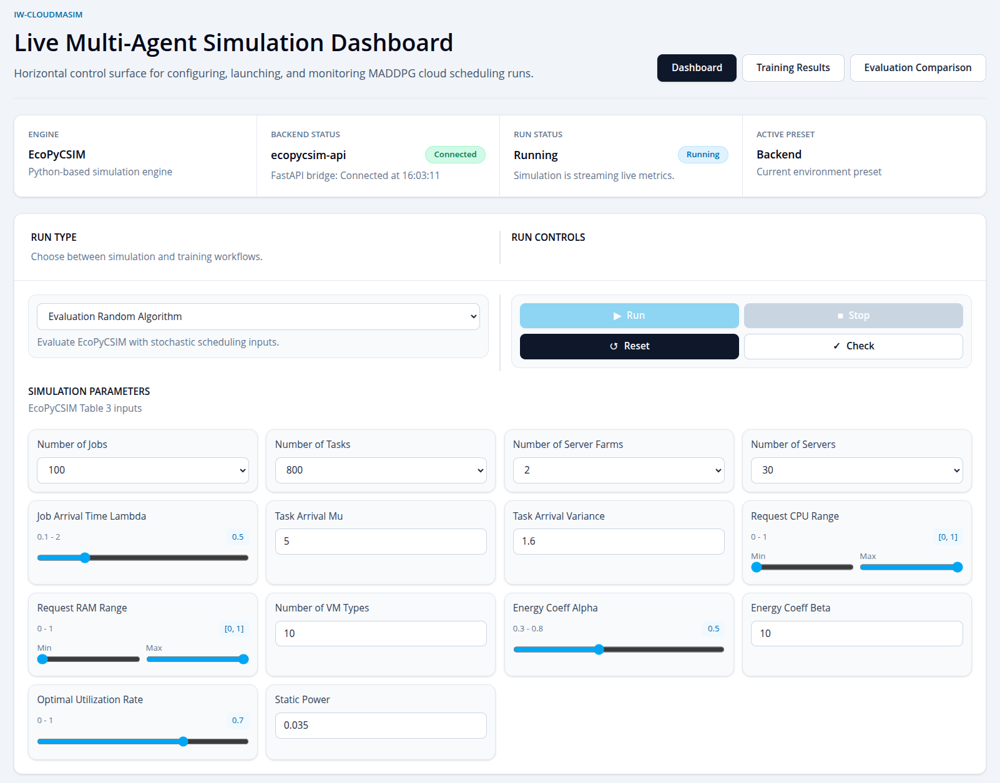

# IW-CLOUDMASIM

Start here if you are setting up or navigating the project.

IW-CLOUDMASIM is a live dashboard for running EcoPyCSIM cloud scheduling experiments. It supports random scheduling evaluation, MADDPG model training, and trained-model evaluation.

## Read First

- Backend/API guide: [ecopycsim_api/README.md](ecopycsim_api/README.md)
- Frontend guide: [frontend/README.md](frontend/README.md)
- Library dependencies: [requirements.txt](requirements.txt)

## Setup

Use Python `3.10.11` for the backend/simulation environment. Newer Python versions may cause dependency issues with the simulation stack.

From the project root, create or use a virtual environment and install the Python requirements:

```bash
python --version  # should be Python 3.10.11
python -m venv venv
venv/bin/pip install -r requirements.txt
```

Install the frontend dependencies:

```bash
cd frontend
npm install
```

## Run The Program

Start the backend API from the project root:

```bash
venv/bin/python run_api.py
```

The API runs at `http://127.0.0.1:8000`. API docs are available at `http://127.0.0.1:8000/docs`.

Start the frontend in a second terminal:

```bash
cd frontend
npm run dev
```

Open the Vite URL shown in the terminal, usually `http://localhost:5173`.

The frontend calls `http://localhost:8000` by default. To use a different API URL:

```bash
VITE_API_BASE_URL=http://localhost:8000 npm run dev
```

## User Interface

| Dashboard | Simulation Result Comparison |
| --- | --- |
|  |  |

| Training Result Comparison | Training Result Comparison Detail |
| --- | --- |
|  |  |

| Training Result Comparison View |
| --- |
|  |

The React dashboard is organized into three main tabs:

- `Dashboard` is the main control area for selecting run type, editing simulation/training parameters, starting runs, stopping runs, and watching live metrics.
- `Training Results` shows saved training history, model progress, reward/loss charts, and training summaries.
- `Evaluation Comparison` compares random scheduling and trained-model evaluation results across completed runs.

The dashboard supports three run modes:

- `Evaluation Random Algorithm` runs the simulation with random scheduling actions.
- `Train Model` trains a MADDPG model and saves the model under `results/dashboard/models/`.
- `Evaluated Trained Model` loads a saved model and evaluates it against matching simulation topology settings.

Use the backend status indicator in the UI to confirm the API is connected before starting a run.

## Navigation

```text
IWcloud/
  README.md                 Start-here guide for the whole project
  ecopycsim_api/README.md   Backend/API details
  frontend/README.md        Frontend details
  run_api.py                Starts the FastAPI backend
  requirements.txt          Main Python simulation/runtime dependencies
  requirements-api.txt      Minimal API server dependencies
  ecopycsim_api/            FastAPI routes and dashboard run orchestration
  frontend/                 React + Vite dashboard
  env/                      EcoPyCSIM simulation environment
  schedulers/               Scheduling algorithms and MADDPG implementation
  components/               Simulation models and helper scripts
  helper/                   Environment construction helpers
  results/                  Generated local run history, logs, and models
```

## Important Generated Files

- `results/` is created by the backend and ignored by Git.
- `results/dashboard/run_history.json` stores dashboard run history.
- `results/dashboard/models.json` stores saved model metadata.
- `results/dashboard/models/<RUN_ID>/model.pt` stores trained model weights.
- `frontend/dist/` is generated by `npm run build` and ignored by Git.
- `frontend/node_modules/` is generated by `npm install` and ignored by Git.

Fresh clones start with no saved models or run history. The backend creates `results/dashboard/` automatically when it runs.

## Common Commands

```bash
# Check Python version
python --version

# Run backend
venv/bin/python run_api.py

# Run frontend
cd frontend
npm run dev

# Build frontend
npm run build

# Lint frontend
npm run lint
```
